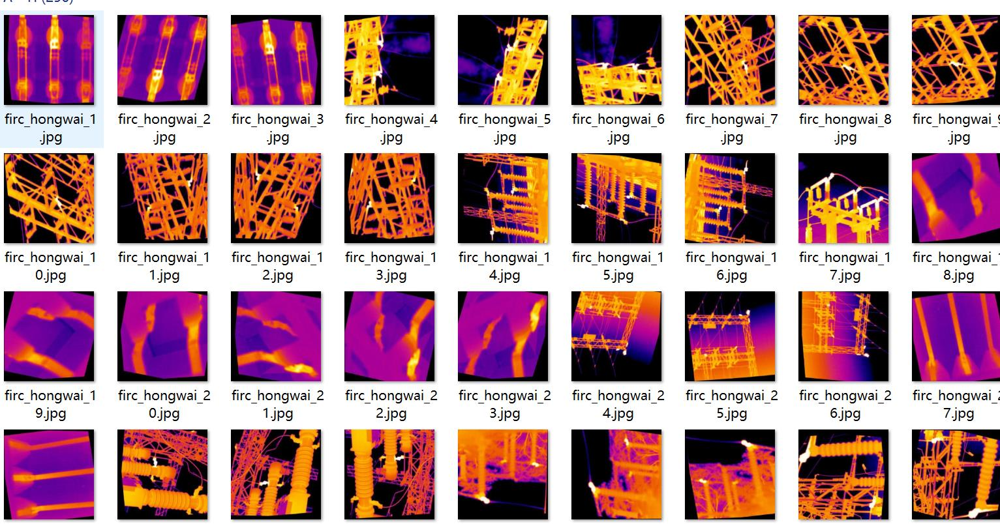
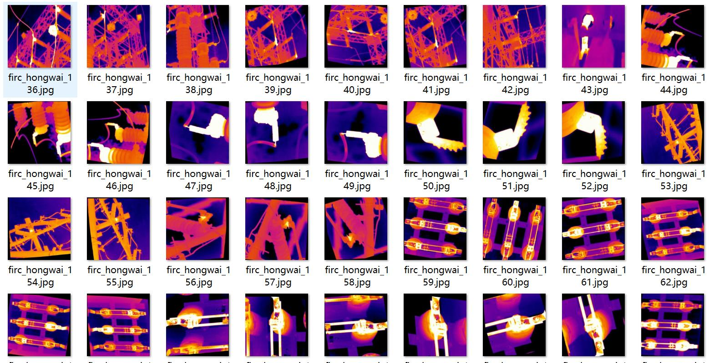
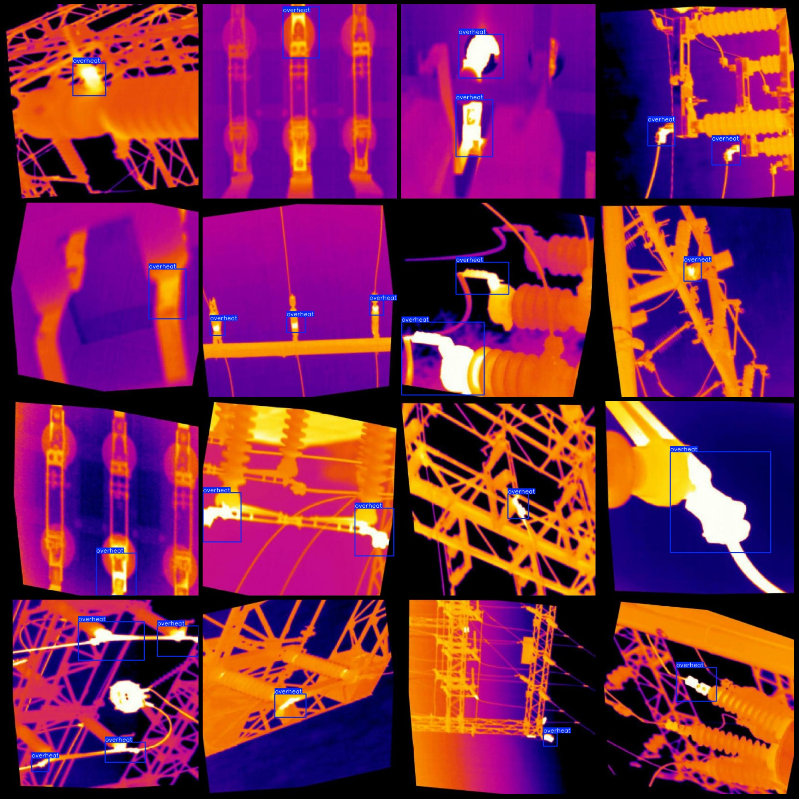
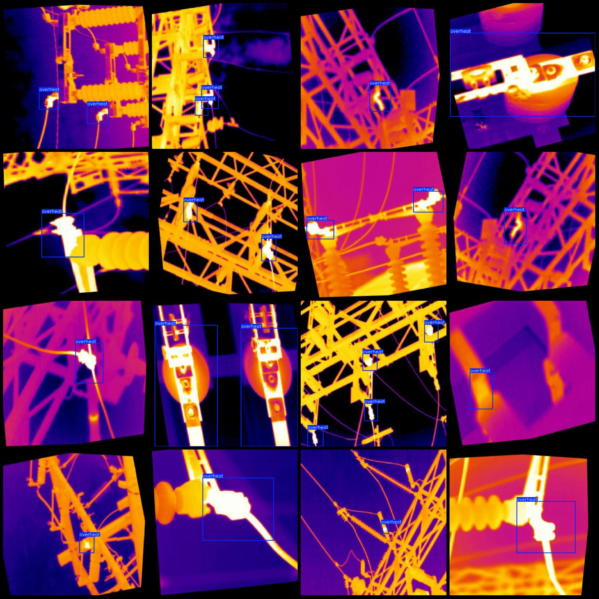

# High-voltage Device Overheating Detection in Substation Infrared Images Dataset - VOC+YOLO with 256 Categories

Note that about one-third of the dataset consists of original images, while the remaining are rotationally enhanced images. 
Dataset format: Pascal VOC format + YOLO format (without split path in txt file, only containing jpg images and corresponding VOC format xml files and yolo format txt files)
number of images: 256  
annotation count: 256  
annotation count: 256  
annotationnumber of classes: 1  
annotation class names:["overheat"]  
boxes per class:   
overheat box count = 382  
total boxes: 382  
images per class:   
overheat images = 256  
image resolution: 640x640  
Use annotation tool: labelImg
Annotation rules: draw a rectangle box around the class.
The dataset has not been split into training, validation, and test sets. Please manually divide it.
Special Notice: This dataset does not guarantee the accuracy of the trained model or weight files.
Preview of the images:
## Images

Here is a pay link on Stripe ( https://buy.stripe.com/3cs8yP7sY87d0vu9AB ). Please contact me lonlonago@foxmail.com after funding $89, and I will send you a complete data files , thank you!

